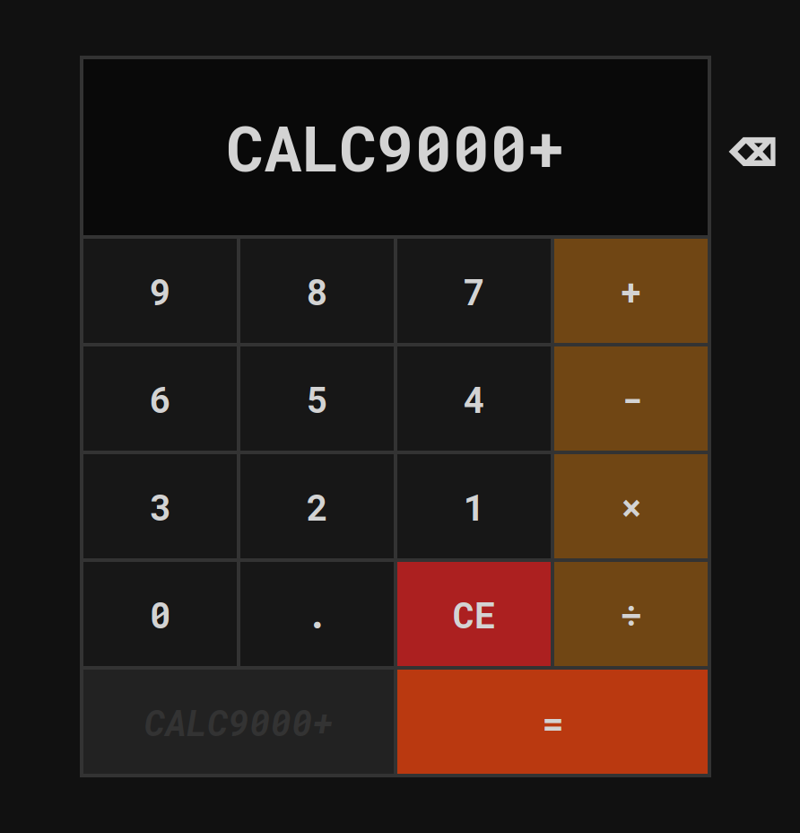

# CALC9000+

## Welcome to CALC9000+!
This is an exercise for The Odin Project for bringing HTML, CSS and JS together.
I learned some interesting things about the power of regular expressions through this.
Overall, quite a fun project!

## Instructions:

Click the buttons with your mouse, or:

* or x to multiply, + to add, - to subtract or for negative numbers, / to divide.

C or Delete to clear, Backspace for correcting smaller errors.

Enter for =. Use your numpad or regular numbers/operators.

NOTE: CALC9000+ rounds results down to three decimal points for simplicity.

